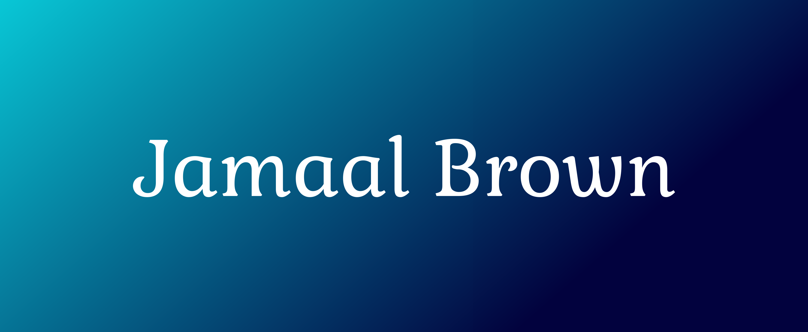

  

 

Full Stack Software Engineer based in Houston, TX

<h2 align="center">Projects </h2>

<table>
<tr>
<td width="50%">
<h3 align="center" color="white">Personal Portfolio</h3>

  

 
 

<strong>JavaScript, CSS3, HTML5</strong> - My portfolio website to showcase my projects and contact information. Open to freelance clients!

  
  
<td width="50%">
<h3 align="center" color="white">API Brewery and Cidery Search</h3>

  

 
 

  

<strong>JavaScript, CSS3, HTML5</strong> - View artist's biography by searching the artist's name. Data rendered by TheAudioDB API.

</table>

<table>
<tr>
<td width="50%">

</td>
<td width="50%">
 
</table>

## Language and Tools:

<!-- <h1 align="center">Hi 👋, I'm Jamaal</h1>
<h3 align="center">Full Stack Software Engineer based in Houston, TX</h3>

- 🔭 I’m currently working on **Brewery Finder Site using Open Brewery DB API**

- 🌱 I’m currently learning **Node.js and MongoDB**

- 👯 I’m looking to collaborate on **open source projects that benefit the health of people and our environment**

- 👨‍💻 All of my projects are available at [https://jamaalbrown.me/](https://jamaalbrown.me/)

- 📫 How to reach me **jamaalbro09@gmail.com**

- ⚡ Fun fact **I was in a marching band. I also have a background in power engineering**

<h3 align="left">Connect with me:</h3>

<h3 align="left">Languages and Tools:</h3>

       
 -->

